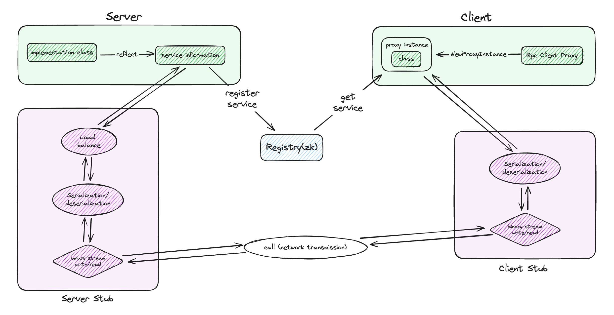

# MinerRPC

## What is MinerRPC
MinerRPC 是一个基于 Socket+Zookeeper 实现的纯GO语言 RPC 框架。

MinerRPC支持动态代理、网络传输、序列化、服务注册、服务发现、服务调用等功能。

## Status
目前MinerRPC适用于学习和小型项目，其中性能和稳定性已经在
[MinerDB](https://github.com/Au-Miner/minerdb) 中得到了验证

## Design overview


## Key features
### 动态代理
MinerRPC是基于纯GO语言实现的，GO语言是编译型的静态语言，无法像Java一样通过javac生成的.class文件动态获取
Interface/类的信息。但是我们可以通过反射（reflect）的方式获取类对象的信息，
来动态修改类对象中只提供输入输出类型的函数字段的实现逻辑，从而实现对类对象的动态代理。

具体来说，实现逻辑被修改为调用zk获取服务地址，并通过client stub执行服务调用。

### 注册中心
MinerRPC使用 Zookeeper 实现服务注册与服务发现。Server端启动时通过反射将实现的类对象中的方法名以及地址
（ip+port）注册到Zookeeper中，Client端通过代理对象的请求服务名称找到对应的服务地址，从而实现服务调用。

### 负载均衡
Client端请求服务时，会根据负载均衡策略选择对应的服务地址进行请求，且支持动态的纵向扩容

### 序列化
目前支持JSON序列化，且为模块化设计，很容易实现自定义扩展

### 网络传输
使用Socket网络传输

## Future Plan
- [ ] 使用 NIO 替代 BIO 实现网络传输
- [ ] 支持更多负载均衡策略
- [ ] 支持更多序列化方式

## Gettings Started
### ZooKeeper
`docker run -d --name zookeeper -p 2181:2181 zookeeper:3.5.8`

### client端
在client端定义请求服务的类信息
```
type Test struct {
	Ping  func() (string, error)
	Hello func() (string, error)
}
```
实现该类对象，并创建动态代理实体，执行服务调用
```
package main

import (
	"fmt"
	"minerrpc/rpc_api/services"
	"minerrpc/rpc_core/transport/client"
)

func main() {
	client := transport_client.NewDefaultSocketClient()
	proxy := transport_client.NewRpcClientProxy(client)

	testService := proxy.NewProxyInstance(&api_services.Test{}).(*api_services.Test)
	res, _ := testService.Ping()
	fmt.Println("The result is: ", res)
	res, _ = testService.Hello()
	fmt.Println("The result is: ", res)
}
```
### server端
在server端实现client端定义的类信息中的方法
```
type TestImpl struct{}

func (s *TestImpl) Ping() (string, error) {
	return "pong", nil
}

func (s *TestImpl) Hello() (string, error) {
	return "name ", nil
}
```
注册该类对象，并启动服务
```
package main

import (
	"fmt"
	"minerrpc/rpc_core/transport/server"
	"minerrpc/rpc_server/servers/services"
	"os"
	"os/signal"
)

func main() {
	srv, err := transport_server.NewDefaultSocketServer("localhost:3212")
	if err != nil {
		panic(err)
	}
	ss := servers_services.TestImpl{}
	srv.Register(&ss)
	go srv.Start()

	stopChan := make(chan os.Signal, 1)
	signal.Notify(stopChan, os.Interrupt)
	sig := <-stopChan
	fmt.Printf("Received %v, initiating shutdown...\n", sig)
}
```


## Thanks
MinerRPC受到了rrpc、boot4go-proxy的启发，十分感谢🙏